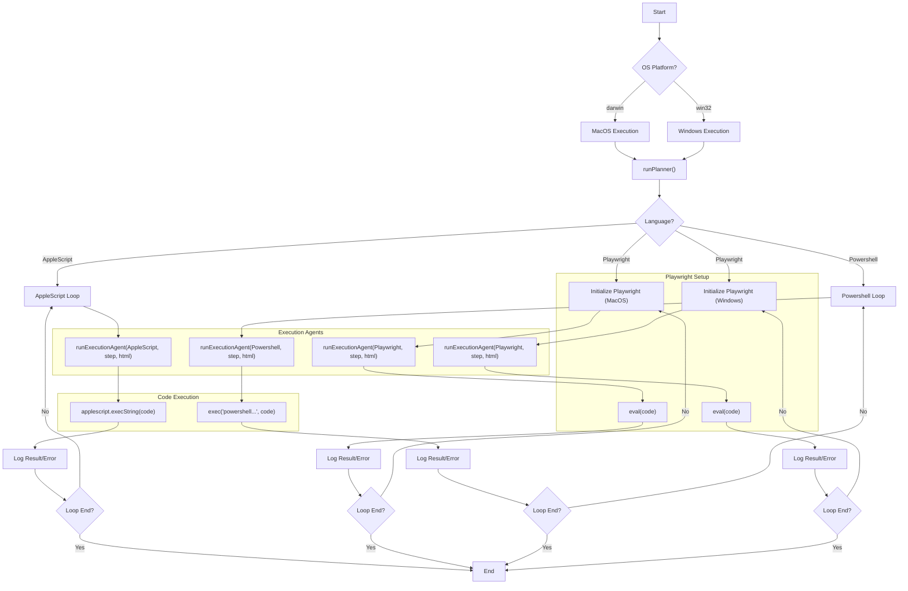

# 🏄 Agent SURF 🌐

**Agent SURF** is an advanced automation tool designed to complete tasks, scrape data, and more on your computer using AI. Using powerful technologies like **Playwright, AppleScript, Powershell**, it takes user prompts (tasks) and breaks them down into actionable steps. The execution agents then follow these steps to efficiently complete the desired actions. Say goodbye to repetitive tasks—Agent SURF does it all for you!  
[ << Demo Video >>](https://www.youtube.com/watch?v=dx3_Sfv_DnY)

* * *

## 🛠️ Installation Guide 📖

### 📦 Prerequisites:

- [Node.js](https://nodejs.org/en) (Required for running the script)
- [npm](https://www.npmjs.com/) (Used to manage project dependencies)
- A Chat Completion API provider that supports OpenAI. **[Groq](https://console.groq.com/keys) is recommended.**
- Enabling Accessibility Permissions for the app you are executing this script in (Terminal, VSCode, Etc) **Settings -&gt; Privacy and Security -&gt; Accessibility -&gt; \[App Name] -&gt; On**
- **OR**
- Terminal/Command Prompt launched with Administrator Access

### 🔧 Installation Steps:

```
git clone https://github.com/ChainedTears/Agent-SURF
cd Agent-SURF
npm init -y
npm install
```

### 🏁 Usage:

```
node script.js
```

*Rememeber to customize the prompt inside index.js and set your own API key before starting the script!*

* * *

## 🏗️ Architecture Overview 🧱



* * *

## 🚀 Support the Project 💖

If you find Agent SURF useful, give this repo a ⭐ and share it with others who might benefit!

*Built with ❤️ by Arthur Jiang and Nam Le. Happy automating!*
