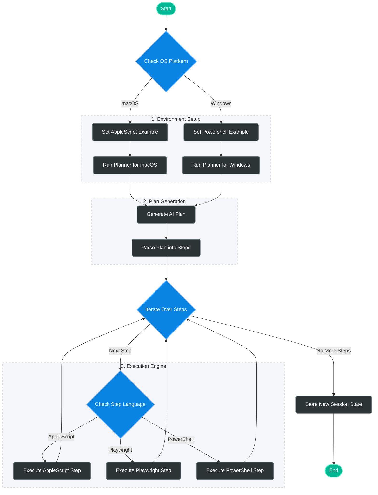

# 🏄 Agent SURF 🌐

**Agent SURF** is an advanced automation tool designed to complete tasks, scrape data, and more on your computer using AI. Using powerful technologies like **Playwright, AppleScript, Powershell**, it takes user prompts (tasks) and breaks them down into actionable steps. The execution agents then follow these steps to efficiently complete the desired actions. Let Agent SURF do the heavy lifting for you.
[ << Demo Video >>](https://www.youtube.com/watch?v=dx3_Sfv_DnY)

* * *

## 🛠️ Installation Guide 📖

### 📦 Prerequisites:

- [Node.js](https://nodejs.org/en) (Required for running the script)
- [npm](https://www.npmjs.com/) (Used to manage project dependencies)
- A Chat Completion API provider that supports OpenAI. **[Groq](https://console.groq.com/keys) is recommended.**
- Enabling Accessibility Permissions for the app you are executing this script in (Terminal, VSCode, Etc):
- - **Settings -&gt; Privacy and Security -&gt; Accessibility -&gt; \[App Name] -&gt; On**
- **OR** launch your terminal with Administrator Access

### 🔧 Installation Steps:

```
git clone https://github.com/ChainedTears/Agent-SURF
cd Agent-SURF
npm init -y
npm install puppeteer-extra puppeteer-extra-plugin-stealth playwright-extra random-useragent playwright applescript openai fs
npx playwright install 
```

### 🏁 Usage:

```
node script.js
```

*Customize the prompt in index.js and set your API key before running the script.*

* * *

## 🏗️ Architecture Overview 🧱


```mermaid
flowchart TD
    %% Terminal Nodes
    A([Start]) --> B{Check OS Platform}

    %% OS Setup Logic
    subgraph OS[1. Environment Setup]
        direction TB
        C[Set AppleScript Example] --> E[Run Planner for macOS]
        D[Set Powershell Example] --> F[Run Planner for Windows]
    end

    B -- "macOS" --> C
    B -- "Windows" --> D

    %% Converge to Planning
    subgraph Planning[2. Plan Generation]
        direction TB
        G[Generate AI Plan] --> H[Parse Plan into Steps]
    end

    E --> G
    F --> G

    %% Execution Loop
    H --> I{Iterate Over Steps}

    subgraph Execution[3. Execution Engine]
        direction TB
        J{Check Step Language} 
        J -- "AppleScript" --> K[Execute AppleScript Step]
        J -- "Playwright" --> M[Execute Playwright Step]
        J -- "PowerShell" --> O[Execute PowerShell Step]
    end

    I -- "Next Step" --> J

    %% Return to loop
    K --> I
    M --> I
    O --> I

    %% Finish Execution
    I -- "No More Steps" --> Q[Store New Session State]
    Q --> R([End])

    %% Theming and Styling
    classDef process fill:#2d3436,stroke:#636e72,stroke-width:2px,color:#fff,rx:5px,ry:5px
    classDef decision fill:#0984e3,stroke:#74b9ff,stroke-width:2px,color:#fff
    classDef terminal fill:#00b894,stroke:#55efc4,stroke-width:2px,color:#fff
    classDef subgraphStyle fill:#f5f6fa,stroke:#dcdde1,stroke-width:2px,stroke-dasharray: 5 5
    
    class A,R terminal
    class B,I,J decision
    class C,D,E,F,G,H,K,M,O,Q process
    class OS,Planning,Execution subgraphStyle
```

* * *

## 🚀 Support the Project 💖

If you find Agent SURF helpful, give this repo a ⭐ and share it with others who may benefit!

Built with ❤️ by Arthur Jiang and Nam Le. Happy automating!

